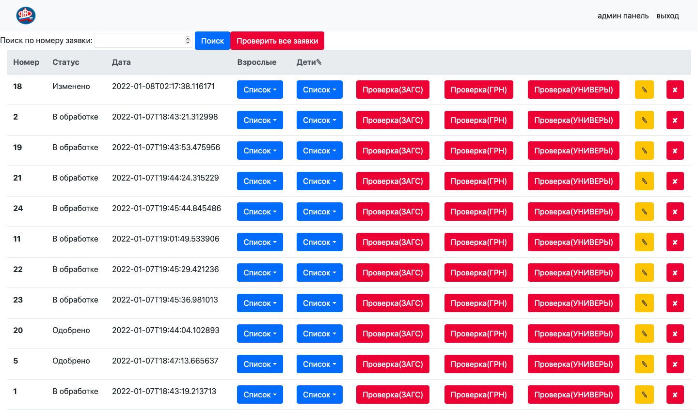

#Java
В данный проект входят 4 программы. Главная - студенческая заявка(StudentOrder).
Этот проект созданы лишь в целях обучения, но эта программа многое
умеет. Есть свои недостатки и недоработки, но все можно сделать при большом желании.
Имеет Веб интерфейс и может принимать заявки и отправлять запросы для их проверки трем другим сервисам.
Они хранят данные и способны принимать запросы.(Три проекта: UniversityBaseNew,
CityRegisterNew и MarriageOfficeNew).
Небольшое ТЗ:
1) Пользователь может подать только одно заявление.
2) Пользователь может посмотреть свое заявление.
3) Пользователь может добавить неограниченное количество детей.
4) Администратор может просматривать, когда подано заявление.
5) Администратор может увидеть, кто подал заявление, и кто его редактировал.
6) Администратор может исправить заявление.
7) Администратор может отправить заявление на проверку во внешние системы.
8) Администратор может добавить/исправить районы города, ЗАГСы, ФМС,
Университеты.
9) Администратор может присвоить собственный статус заявления.
10) Внешние системы могут принимать запросы, обрабатывать их и отправлять результат обратно
в студенческую заявку.

